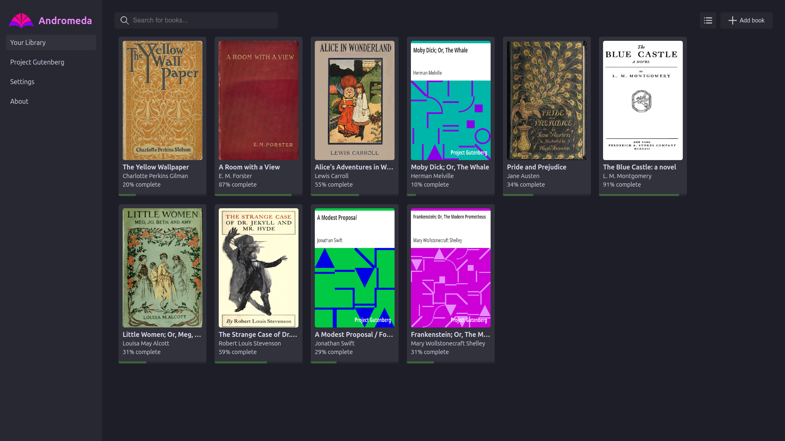
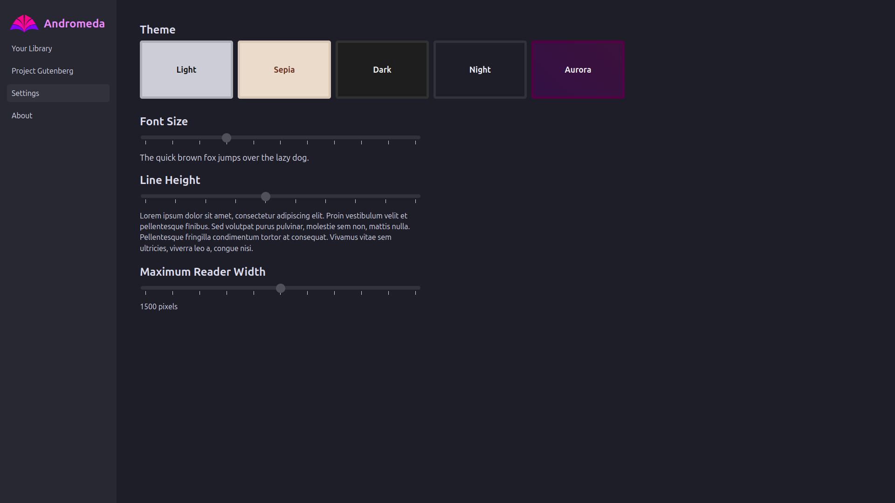

# Andromeda: EPUB Reader for Chrome

Andromeda is an extension for Chrome that allows you to read and manage EPUB files in your browser. Some of its features include:

* A clean, distraction-free reading interface
* Integration with Project Gutenberg's library of free EPUB books
* Five different color themes to choose from
* A built-in library to manage your EPUB files
* Completely free and open-source

